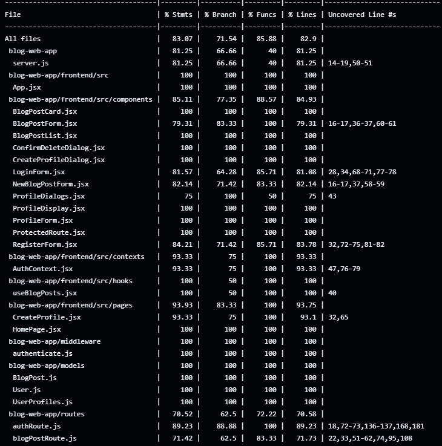

# blog-web-app

## Team Contributions
- **Ross (33%)**: Responsible for User Authentication, including enabling user registration and login, implementing password hashing for secure storage, and applying CSRF protection and input sanitization to prevent security issues. (See [routes/authRoute.js](routes/authRoute.js) and [models/User.js](models/User.js).)
- **Guillaume (33%)**: Responsible for Blog Post Management by restricting editing and deletion to post authors, implementing blog post creation, editing, and deletion. Also implemented CI/CD pipeline. (See [routes/blogPostRoute.js](routes/blogPostRoute.js) and [frontend/src/pages/BlogPosts.jsx](frontend/src/pages/BlogPosts.jsx).)
- **Asa (33%)**: Responsible for User Profiles by enabling users to create, edit, delete, and view their profile details. Standardizing theming across the frontend. Also Implemented CSRF protection of user profile routes. (See [frontend/src/pages/UserProfile.jsx](frontend/src/pages/UserProfile.jsx) and [routes/userProfilesRoute.js](routes/userProfilesRoute.js).)

## Setup Instructions
1. **Clone the repository.**
2. **Install Dependencies:**
   - Root: Run `npm install` using the [package.json](package.json) in the root directory.
   - Frontend: Navigate to the `frontend` folder and run `npm install` ([frontend/package.json](frontend/package.json)).
3. **Running the Application:**
   - **Development Server:** Run `npm run dev` (for backend use `nodemon server.js` as defined in [package.json](package.json)).
   - **To start frontend:** CD into the frontend folder and then Run `npm run dev`.
4. **Testing:**
   - Execute tests by running `npm test`. This runs both frontend and backend tests as configured in [jest.config.js](jest.config.js).

## Features

**User Authentication:**  
- Enabled via registration and login flows with JWT-based sessions.  
- Implemented in [routes/authRoute.js](routes/authRoute.js) for handling user registration and login.  
- Password hashing and user validation are managed in [models/User.js](models/User.js), ensuring secure credential storage.

**Access Control:**  
- Editing and deleting blog posts are restricted to their respective authors.  
- Implemented in [routes/blogPostRoute.js](routes/blogPostRoute.js), which verifies the user's identity before allowing modifications.  
- The frontend ([frontend/src/pages/BlogPosts.jsx](frontend/src/pages/BlogPosts.jsx)) enforces UI restrictions by showing editing options only to the post author.

**User Profiles:**  
- Users can create, edit, delete, and view their profile details.  
- Profile management operations are handled in [routes/userProfilesRoute.js](routes/userProfilesRoute.js) and integrated with frontend pages such as [frontend/src/pages/UserProfile.jsx](frontend/src/pages/UserProfile.jsx) and [frontend/src/pages/CreateProfile.jsx](frontend/src/pages/CreateProfile.jsx).  
- Security is enhanced with CSRF protection and input sanitization throughout the profile management workflow.

**Blog Post Management:**  
- Blog posts can be created, updated, deleted, and fetched effectively.  
- Implemented in [routes/blogPostRoute.js](routes/blogPostRoute.js) and rendered in the frontend via [frontend/src/pages/BlogPosts.jsx](frontend/src/pages/BlogPosts.jsx).  

**Security Enhancements**  
- **Password Hashing:** Store passwords securely using bcrypt.  
  Implemented in [models/User.js](models/User.js).  
- **CSRF Protection:** Implemented using the csurf middleware in Express.  
  Evidence available in [server.js](server.js).  
- **Input Sanitization:** Validate and sanitize user inputs to prevent SQL injection and XSS attacks.  
  Implemented consistently across the application. See [frontend/src/pages/CreateProfile.jsx](frontend/src/pages/CreateProfile.jsx) and [routes/authRoute.js](routes/authRoute.js).

## Challenges and Solutions:

- **CSRF Integration:**  
  - *Challenge:* Implementing CSRF protection using middleware.  
  - *Solution:* Utilized the csurf middleware in Express with proper cookie parsing, and exposed a CSRF token endpoint in [server.js](server.js) to integrate seamlessly with frontend requests.  
  
- **Input Validation and Sanitization:**  
  - *Challenge:* Preventing XSS and SQL injection attacks.  
  - *Solution:* Leveraged express-validator in backend routes (e.g., [routes/authRoute.js](routes/authRoute.js)) and integrated DOMPurify in frontend components (e.g., [frontend/src/pages/CreateProfile.jsx](frontend/src/pages/CreateProfile.jsx)) for consistent input sanitization.  
  
- **Database Setup and Connectivity:**  
  - *Challenge:* Establishing a reliable connection to the MongoDB database and handling connection errors.  
  - *Solution:* Configured the database connection in [server.js](server.js) with error handling and logging mechanisms, ensuring robust connection pooling and reconnection strategies.  
  
- **CI/CD Integration:**  
  - *Challenge:* Automating tests, linting, and deployments in a consistent manner across environments.  
  - *Solution:* Implemented GitHub Actions workflows in [`.github/workflows/ci.yml`](.github/workflows/ci.yml) to automate these processes, ensuring that every commit triggers a suite of tests and code quality checks.  
  
- **Dependency and Environment Management:**  
  - *Challenge:* Maintaining consistent dependency versions and environment configurations across development and production.  
  - *Solution:* Leveraged a centralized [package.json](package.json) and environment configuration files (e.g, .env) to manage dependencies and configuration variables.  

- **Refactoring and Code Quality:**  
  - *Challenge:* Continuously refactoring code while ensuring no regressions.  
  - *Solution:* Adopted best practices enforced by ESLint (see [frontend/eslint.config.js](frontend/eslint.config.js)) and maintained a rigorous code review process documented in commit histories and pull requests.

## Evidence:

### 1. Feature Implementation Evidence

- **Implementation References:**  
  - **User Authentication Flows:** 
    - **Login and Registration:** Implemented in [routes/authRoute.js](routes/authRoute.js) for handling user registration and login. The backend uses bcrypt for password hashing and JWT for session management, ensuring secure credential storage. The frontend components for login and registration are [LoginForm.jsx](../frontend/src/components/LoginForm.jsx) and [RegisterForm.jsx](../frontend/src/components/RegisterForm.jsx), which handle user input and form submission.
    - **Context Management:** The authentication state is managed using React Context in [AuthContext.jsx](../frontend/src/contexts/AuthContext.jsx), providing a global state for user authentication status and profile information.
    - **Protected Routes:** Routes that require authentication are protected using a custom component [ProtectedRoute.jsx](../frontend/src/components/ProtectedRoute.jsx), which checks the user's authentication status before rendering the protected component.

  - **Blog Posts Management:**
    - **CRUD Operations:** Implemented in [routes/blogPostRoute.js](../routes/blogPostRoute.js) for creating, reading, updating, and deleting blog posts. The frontend components [BlogPostCard.jsx](../frontend/src/components/BlogPostCard.jsx) and [BlogPostList.jsx](../frontend/src/components/BlogPostList.jsx) handle the display and interaction with blog posts.
    - **Hooks and State Management:** Custom hooks like [useBlogPosts.jsx](../frontend/src/hooks/useBlogPosts.jsx) are used to fetch and manage the state of blog posts, ensuring a clean and modular approach to state management.
    - **Access Control:** Editing and deleting blog posts are restricted to their respective authors, enforced in the backend routes and reflected in the frontend UI.

  - **User Profile Management:**
    - **Profile Operations:** Users can create, edit, delete, and view their profile details. These operations are handled in [routes/userProfilesRoute.js](../routes/userProfilesRoute.js) and integrated with frontend pages such as [UserProfile.jsx](../frontend/src/pages/UserProfile.jsx) and [CreateProfile.jsx](../frontend/src/pages/CreateProfile.jsx).
    - **Form Handling and Validation:** The frontend components use form handling and validation techniques to ensure data integrity. For example, [CreateProfile.jsx](../frontend/src/pages/CreateProfile.jsx) uses DOMPurify to sanitize user inputs before sending them to the backend.

  - **Security Enhancements:**
    - **Password Hashing:** Passwords are securely stored using bcrypt, implemented in [models/User.js](../models/User.js).
    - **CSRF Protection:** Implemented using the csurf middleware in Express, with evidence available in [server.js](../server.js). CSRF tokens are included in requests to protect against cross-site request forgery attacks.
    - **Input Sanitization:** User inputs are validated and sanitized to prevent SQL injection and XSS attacks. This is consistently implemented across the application, as seen in [authRoute.js](../routes/authRoute.js) and [CreateProfile.jsx](../frontend/src/pages/CreateProfile.jsx).

  - **Authorization:**
    - **JWT-Based Sessions:** User sessions are managed using JWT, ensuring secure and stateless authentication. The tokens are generated and verified in [authRoute.js](../routes/authRoute.js).
    - **Role-Based Access Control:** Certain actions, such as editing or deleting blog posts, are restricted to authorized users. This is enforced in the backend routes and reflected in the frontend UI.

- **Screenshots:**
  - Below are screenshots of the application features:

  Registration Page
  
  Login Page
  
  Blog Posts Page
  
  User Profile Page
  

  The features are fully demonstrated in our walkthrough video.

### 2. Testing Evidence
- Unit and integration tests cover key functionalities using Jest and Testing Library. Testing approaches include TDD and handling edge cases.
- **Testing Approach:**
  - **Unit Tests:** Focus on individual components and functions to ensure they work as expected in isolation. Examples include [`frontend/src/components/BlogPostCard.test.jsx`](../frontend/src/components/BlogPostCard.test.jsx) and [`tests/user.test.js`](../tests/user.test.js).
  - **Integration Tests:** Verify that different parts of the application work together correctly. Examples include [`tests/authRoute.test.js`](../tests/authRoute.test.js) and [`tests/routes/userProfilesRoute.test.js`](../tests/routes/userProfilesRoute.test.js).
  - **Test-Driven Development (TDD):** Applied by writing tests before implementing the corresponding functionality. This approach was used extensively in developing user authentication and profile management features.
  - **Behavior-Driven Development (BDD):** Utilized to ensure that the application behaves as expected from the user's perspective. This is reflected in tests for user interactions, such as form submissions and navigation, found in files like [`frontend/src/components/LoginForm.test.jsx`](../frontend/src/components/LoginForm.test.jsx) and [`frontend/src/components/RegisterForm.test.jsx`](../frontend/src/components/RegisterForm.test.jsx).

- **Implementation References:**  
  - Backend tests: [`tests/authenticate.test.js`](tests/authenticate.test.js), [`tests/authRoute.test.js`](tests/authRoute.test.js), [`tests/routes/userProfilesRoute.test.js`](tests/routes/userProfilesRoute.test.js), [`tests/server.test.js`](tests/server.test.js), [`tests/user.test.js`](tests/user.test.js)
  - Frontend tests: [`frontend/src/components/BlogPostCard.test.jsx`](frontend/src/components/BlogPostCard.test.jsx), [`frontend/src/components/ConfirmDeleteDialog.test.jsx`](frontend/src/components/ConfirmDeleteDialog.test.jsx), [`frontend/src/components/CreateProfileDialog.test.jsx`](frontend/src/components/CreateProfileDialog.test.jsx), [`frontend/src/components/LoginForm.test.jsx`](frontend/src/components/LoginForm.test.jsx), [`frontend/src/components/ProfileDialogs.test.jsx`](frontend/src/components/ProfileDialogs.test.jsx), [`frontend/src/components/ProfileDisplay.test.jsx`](frontend/src/components/ProfileDisplay.test.jsx), [`frontend/src/components/ProfileForm.test.jsx`](frontend/src/components/ProfileForm.test.jsx), [`frontend/src/components/ProtectedRoute.test.jsx`](frontend/src/components/ProtectedRoute.test.jsx), [`frontend/src/components/RegisterForm.test.jsx`](frontend/src/components/RegisterForm.test.jsx), [`frontend/src/pages/CreateProfile.test.jsx`](frontend/src/pages/CreateProfile.test.jsx), [`frontend/src/pages/HomePage.test.jsx`](frontend/src/pages/HomePage.test.jsx), [`frontend/src/pages/UserProfile.test.jsx`](frontend/src/pages/UserProfile.test.jsx), [`frontend/src/pages/BlogPosts.test.jsx`](frontend/src/pages/BlogPosts.test.jsx)

- **Edge Cases and Error Conditions:**
  - Tests were designed to cover various edge cases and error conditions, such as invalid input, missing fields, and network errors. Examples include:
    - [`frontend/src/components/NewBlogPostForm.test.jsx`](../frontend/src/components/NewBlogPostForm.test.jsx) which tests form validation and error handling.
    - [`tests/authRoute.test.js`](../tests/authRoute.test.js) which includes tests for invalid login attempts and user registration errors.

- **Screenshot of Test Coverage:**
  - Below is a screenshot of our overall test coverage.
  

### 3. Security Enhancements Evidence
- Security is ensured through password hashing, CSRF protection, and input sanitization.
- **Implementation References:**  
  - Password hashing: [models/User.js](../models/User.js)  
  - CSRF protection: Implemented in [server.js](../server.js) and used in routes (e.g., [routes/authRoute.js](../routes/authRoute.js), [routes/userProfilesRoute.js](../routes/userProfilesRoute.js), [routes/blogPostRoute.js](../routes/blogPostRoute.js))  
  - Input validation/sanitization: [routes/authRoute.js](../routes/authRoute.js), [frontend/src/pages/CreateProfile.jsx](../frontend/src/pages/CreateProfile.jsx), [frontend/src/pages/UserProfile.jsx](../frontend/src/pages/UserProfile.jsx), [frontend/src/pages/BlogPostForm.jsx](../frontend/src/pages/BlogPostForm.jsx), [frontend/src/components/NewBlogPostForm.jsx](../frontend/src/components/NewBlogPostForm.jsx)

### 4. Code Quality and Refactoring Evidence
The codebase is modularized following best practices and adheres to ESLint standards. Refactoring improved readability and maintainability.
- **Implementation References:**  
  - Modular components: [frontend/src/components/](../frontend/src/components/), [frontend/src/hooks/](../frontend/src/hooks/), [frontend/src/pages/](../frontend/src/pages/), [frontend/src/contexts/](../frontend/src/contexts/)
  - Linting configuration: [frontend/eslint.config.js](../frontend/eslint.config.js), [backend/.eslintrc.js](../backend/.eslintrc.js) and adherence observed in commit logs.

### 5. CI/CD and Git Practices Evidence
- **Description:** CI/CD workflows are configured via GitHub Actions to automate tests and code quality checks. Git practices demonstrate collaboration via branching and pull requests.
- **Implementation References:**  
  - CI/CD configuration: [/.github/workflows/ci.yml](../.github/workflows/ci.yml), [/.github/workflows/deploy.yml](../.github/workflows/deploy.yml)
  - Git commit history and branching strategy: Refer to repository commit logs and pull request discussions. Evidence of branching strategy can be seen in the [branches](../branches) and [pull requests](../pulls) sections of the repository.